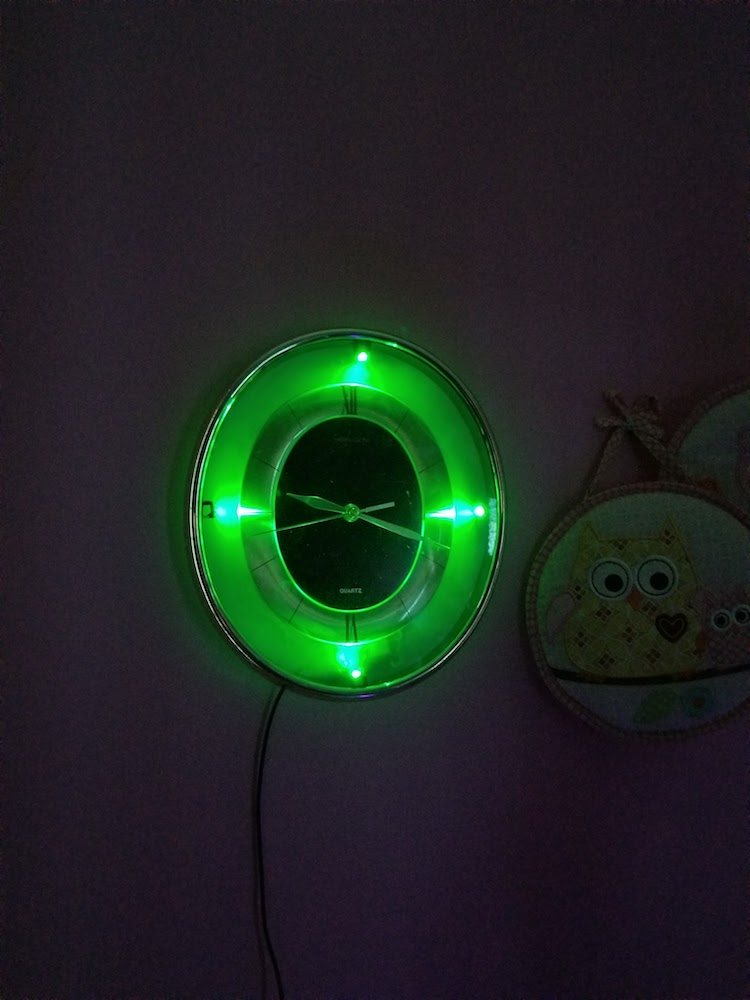
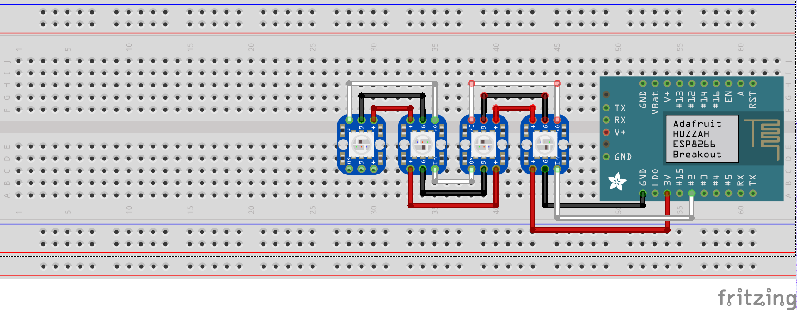

# Kid Clock

A simple clock that I built for my daughter to let her know when it's okay to
leave her room in the morning after she wakes up. At night, the clock is a
purple night light and in the morning it turns green.

## Parts

* [NodeMCU development board](http://amzn.to/2zxyUX1) ($9.00)
* [NeoPixel](http://amzn.to/2xZKoGL) (I used [breadboard pixels](https://www.adafruit.com/product/1312), but a strip should be a drop-in replacement)
* Miscellaneous wires
* A clock (I got mine at Goodwill)

## Wiring

The control wire connests to pin #4 on the ESP8266 board (D2 on the DevKit).

## Code

The code is pretty simple. It connects to NTP every 10 seconds to get the current
time (in UTC-4). To setup the code for your network and timezone just open `KidClock.ino`
and change the `ssid`, `pass` and `utc_offset` variables.
